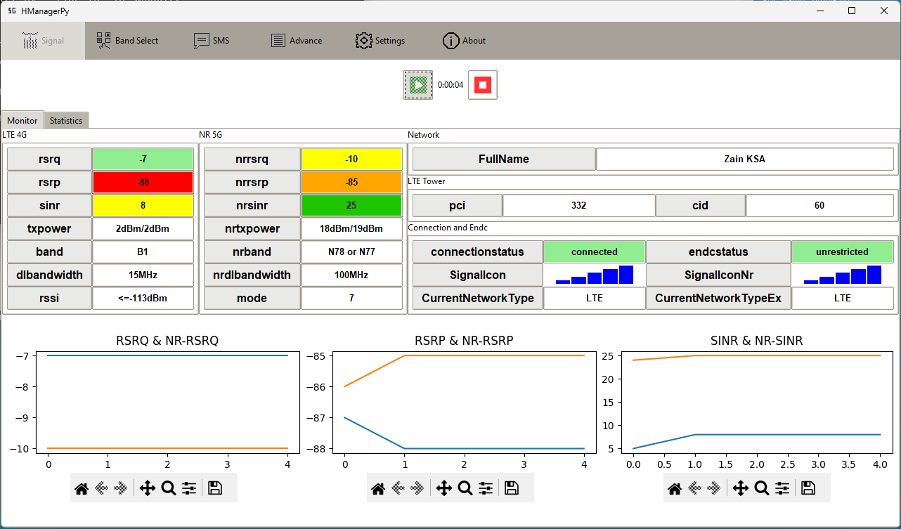

<p align="center">
  
</p>


# About
HManagerPY v2.0 is a redo of my previous app HManagerPY v1.1

libs:  
Tkinter  
huawei-lte-api  
Matplotlib  
  
Tested on Huawei 5G CPE H122-373 / H122-370

## Key Features (by ChatGPT):
1. Signal Monitoring:

    Keep a close eye on your signal strength and quality in real-time. With comprehensive graphical representations, stay informed about network performance at a glance.
2. LTE Band Selection:

    Take control of your LTE experience by choosing the optimal band for your needs. Whether it's maximizing speed or improving coverage, HManagerPY v2.0 puts the power in your hands.
3. SMS Management:

    Efficiently handle your SMS communications directly from within the app. Read and send messages seamlessly, without the need to switch between multiple applications.

## Prerequisites (Windows)
1. Clone the repo
   ```
   git clone https://github.com/sapy22/huawei_manager_py
   ```

2. Navigate to the app folder
   ```
   cd huawei_manager_py
   ```

3. Create a virtual environment
   ```
   py -m venv venv
   ```

4. Activate the venv
   ```
   .\venv\Scripts\activate
   ```

5. Install the dependencies
   ```
   pip install -r requirement.txt
   ```

## Usage (Windows)
### # run_app.bat
### OR
### # Command Line (cmd)
1. Navigate to the app folder  
   ```
   cd huawei_manager_py
   ```

2. Activate the venv
   ```
   .\venv\Scripts\activate
   ```

3. Run the script
   ```
   py main.py
   ```

## Linux
On Ubuntu, you need to install python3-tk and python3-venv. Arabic text is not fully supported, though.  
      ```
      python3 -m venv venv
      ```  
      ```
      source venv/bin/activate
      ```  
      ```
      pip install -r requirement.txt
      ```  
      ```
      python3 main.py
      ```

## Note
Check docs for more info.